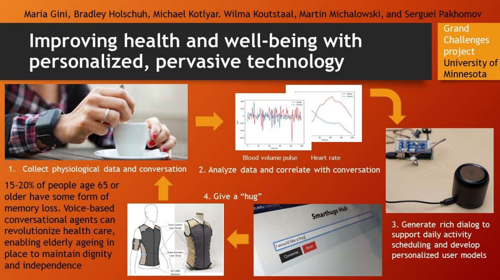

# Wearable Technology Lab (WTL) - Grand Challenges Research Project

The long-term objective of the project was to develop pervasive systems capable of monitoring
language, activity, and the physical state of users; modeling the user’s cognitive and emotional
state to identify needs for intervention; and intervening through language-based conversation
and/or calming physical responses. The project is summarized in the figure below. 

[Research Spotlight Video](v=IygiRompItI&ab_channel=CollegeofScienceandEngineering%2CUMN "Research Spotlight: UMN 'Smart hug' technology aims to improve health and well-being")

[Final Report](https://smarthugs.umn.edu/sites/smarthugs.umn.edu/files/2021-07/FinalReport.pdf "Improving health and well-being with personalized, pervasive technology")
